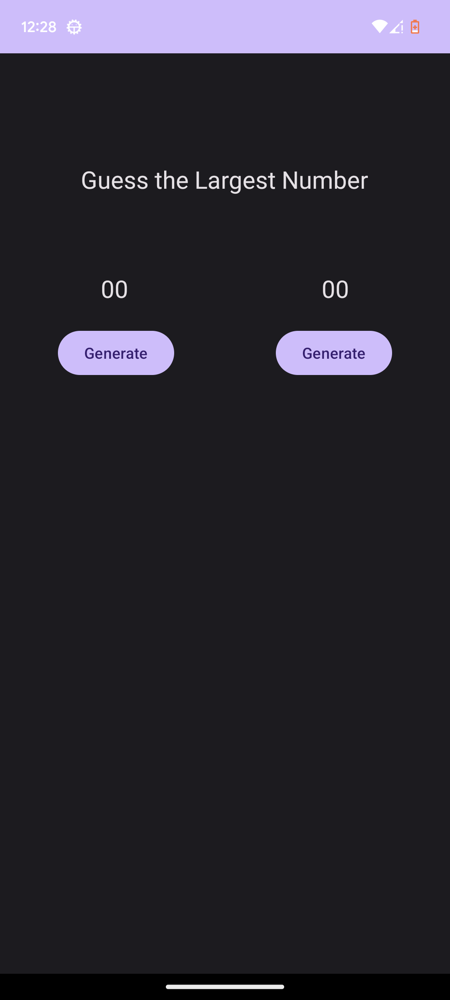
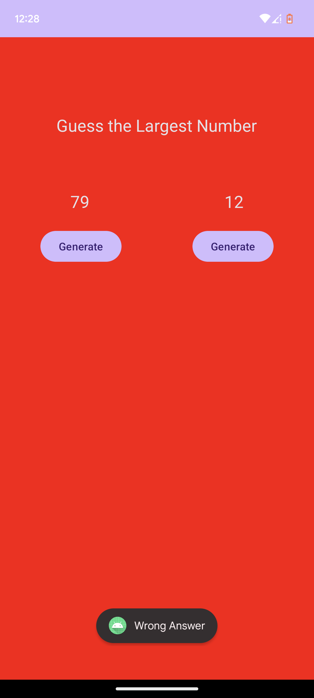
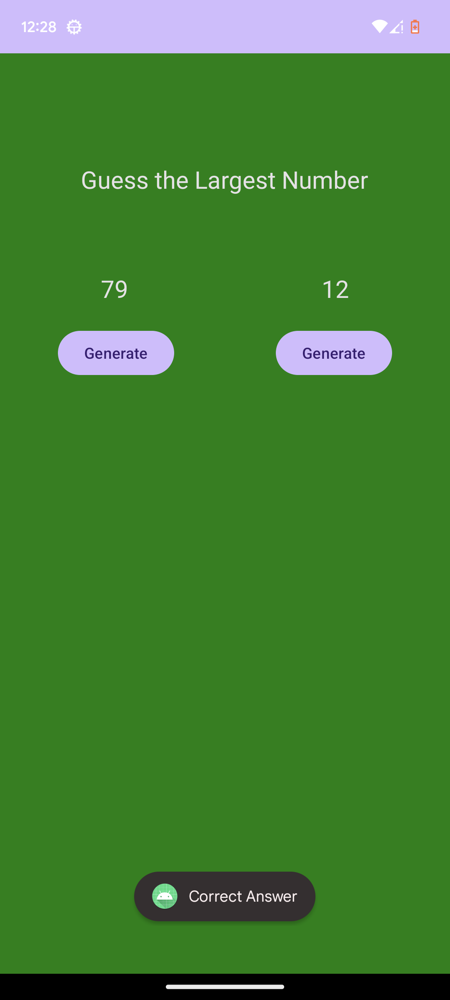

# Number Guessing Game

initialy there will be 2 text fields and 2 bottons. 
Which will generate 2 random numbers first.
When the user press on the text field the app will tell the correct answer with color and message(toast).

  
